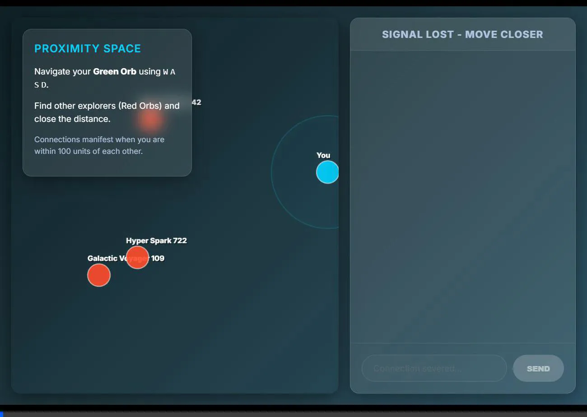
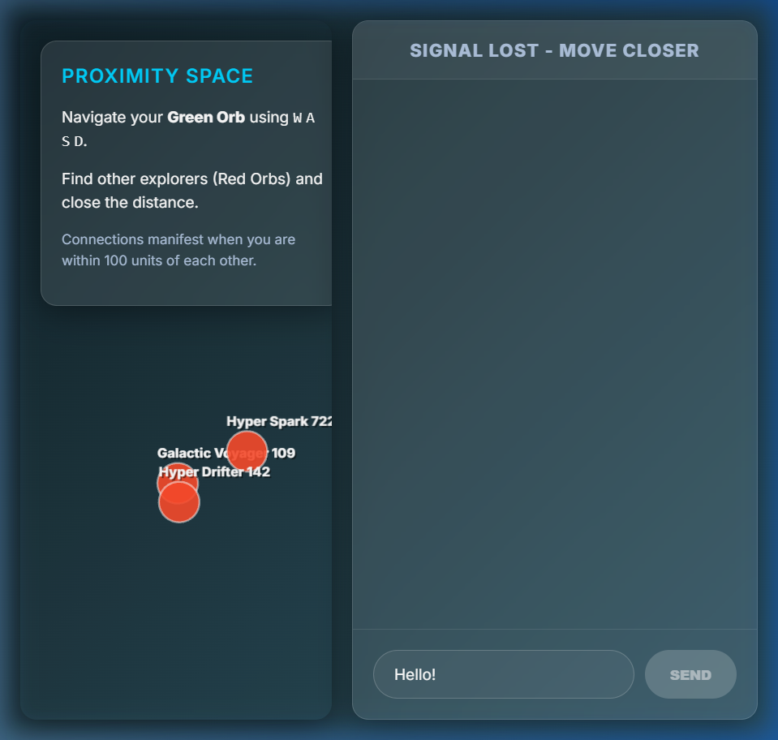

<div align="center">
  <h1>🚀 Proximity Space</h1>
  <p>A high-performance, real-time multiplayer 2D proximity chat application.</p>

  
  <br /><br />
  
</div>

---

## 🌟 Overview

**Proximity Space** enables users to move freely in a shared 2D environment and interact based on spatial proximity. Communication dynamically activates when users are near and disconnects when they move apart.

---

## ✨ Core Features

### 1. Real-Time 2D Environment
- Built using **React** and **PixiJS** for smooth 60 FPS rendering.
- Users represented as animated glowing orbs.
- Movement via **W, A, S, D** controls.

---

### 2. Proximity-Based Interaction Engine
- Real-time position tracking using **Socket.IO**.
- Distance-based connection logic.
- Visual indicators:
  - Radar rings (interaction range)
  - Connection beams (active links)

---

### 3. Intelligent Chat System
- Chat auto-enables when users are within range.
- Chat auto-disables when users move away.
- Uses Socket.IO rooms for dynamic communication.

---

### 4. Modern UI/UX
- Glassmorphism UI using `backdrop-filter`.
- Space-themed gradients and effects.
- Auto-generated sci-fi usernames.
- Clean, minimal interface.

---

## 🛠️ Tech Stack

### Frontend
- React (Vite)
- PixiJS (`@pixi/react`)
- CSS (Custom + Glassmorphism)

### Backend
- Node.js
- Express.js
- Socket.IO

---

## ⚙️ System Architecture

- **Client** → Handles rendering, movement, UI
- **Server** → Manages users, positions, connections
- **Socket.IO** → Real-time communication
- **In-memory state** → Fast performance without DB

---

## 🚀 Getting Started

### Prerequisites
- Node.js (v16+)
- npm

---

### 1. Start Backend
```bash
cd server
npm install
npm start
